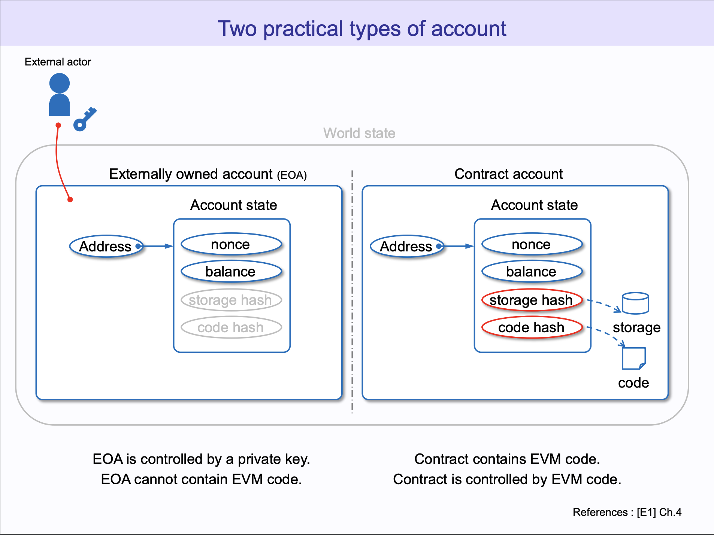
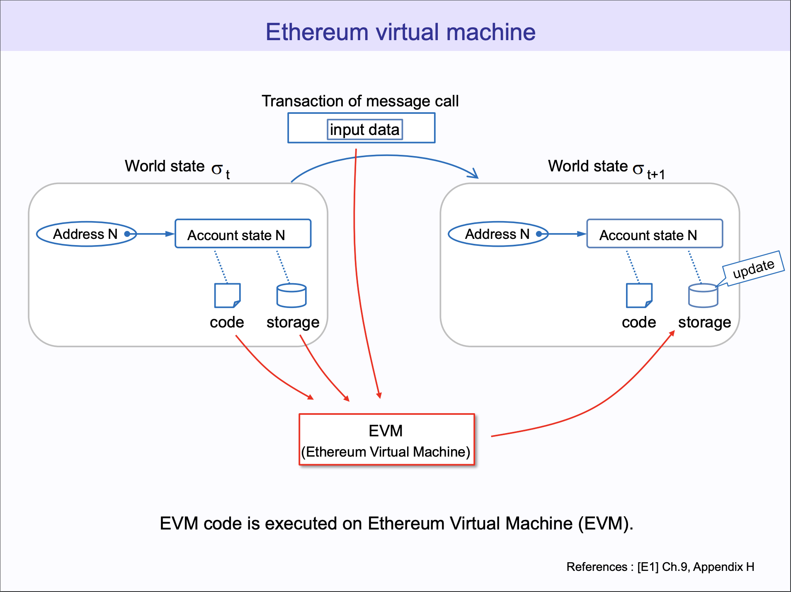
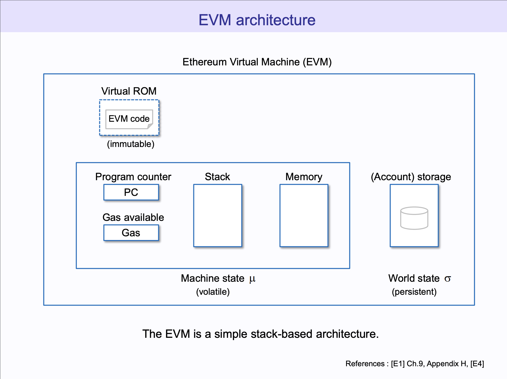
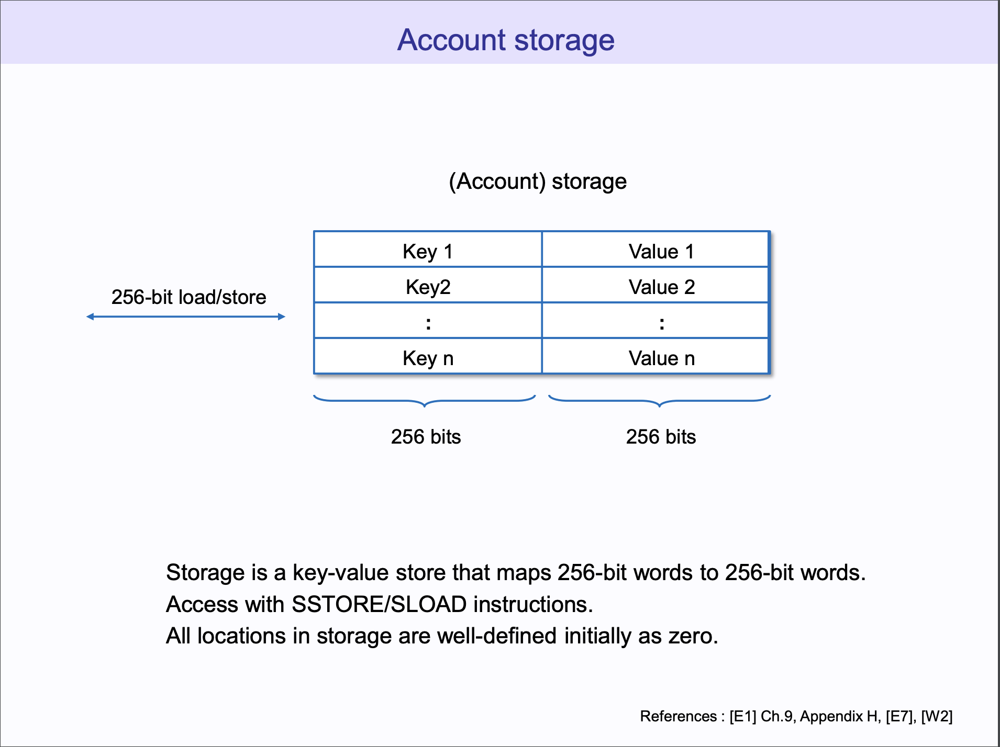
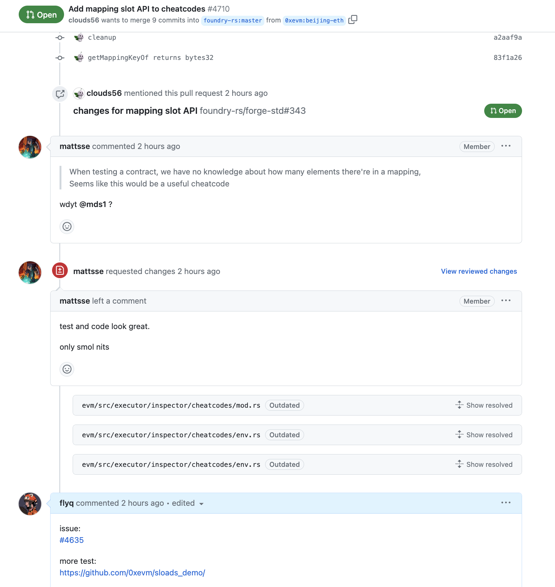
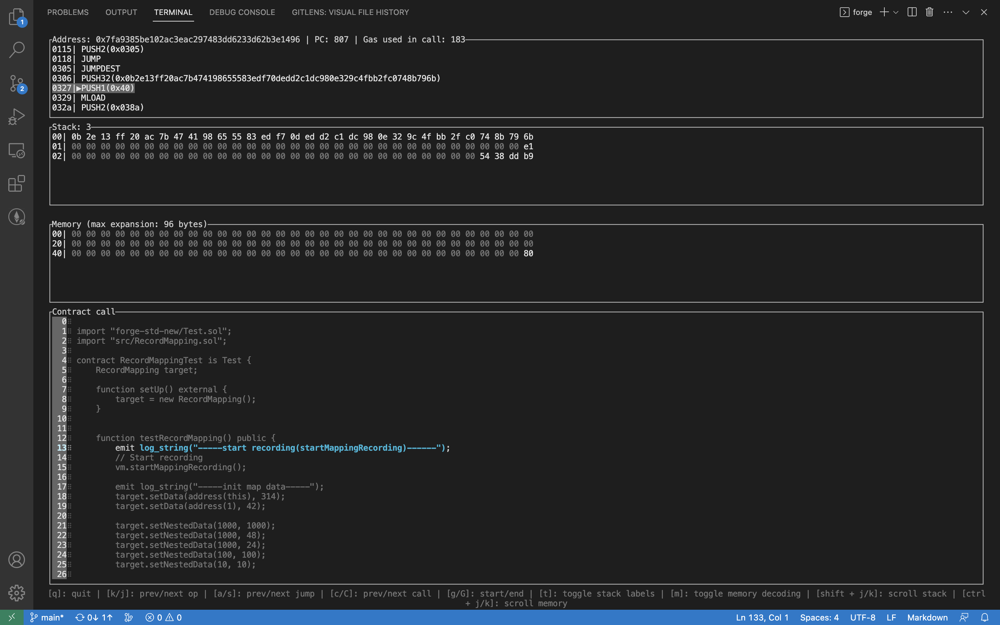

# SLOADS

## 背景介绍

### EVM









**SLOAD**

问题：

一个智能合约下面就一个 Map 可以存，那 Solidity 里面那么多数据该怎么存？

根据这里的描述：[Layout of State Variables in Storage](https://docs.soliditylang.org/en/develop/internals/layout_in_storage.html)，静态数据就是打包后从 Key1， Key2 开始依次存。动态数据比如 map，是通过 hash 了 Slot 以及 key，获得的值就是 storage slot，value 就存在这个 slot 里面。

```sh
$ forge inspect ./src/RecordMapping.sol:RecordMapping storage --pretty
| Name       | Type                                         | Slot | Offset | Bytes | Contract                            |
| ---------- | -------------------------------------------- | ---- | ------ | ----- | ----------------------------------- |
| length     | int256                                       | 0    | 0      | 32    | src/RecordMapping.sol:RecordMapping |
| data       | mapping(address => int256)                   | 1    | 0      | 32    | src/RecordMapping.sol:RecordMapping |
| nestedData | mapping(int256 => mapping(int256 => int256)) | 2    | 0      | 32    | src/RecordMapping.sol:RecordMapping |
```
这里是一个示例，静态数据 length 在 slot 0，两个 map 分别在 slot 1 和 slot 2，map 里面的元素就通过 hash 分布了一个 2^256 大小的空间中，这样可以防碰撞。


### Foundry

Foundry 是一个 Paradigm 主导的，比较流行的以太坊框架。它可以使用 solidity 来写 Test & Script。

https://github.com/foundry-rs/

## 我们的工作

问题

某个合约，经过一些交易之后它的 Storage 布局是怎样的？

我们修改了 Foundry， 提交了 PR，： https://github.com/foundry-rs/foundry/pull/4710/files



## demo 演示

```sh

forge test -vvv
[⠒] Compiling...
No files changed, compilation skipped

Running 1 test for test/RecordMapping.t.sol:RecordMappingTest
[PASS] testRecordMapping() (gas: 331273)
Logs:
  -----start recording(startMappingRecording)------
  -----init map data-----
  -----test getMappingLength-----
  data's length: 2
  -----test getMappingSlotAt-----
  map data's 0th slot index: 0xb38645331535d8a24250bd866c230d0d85c11b90105fdba49ccc7bb4d9c6bc96
  map data's 0th slot index: 0xb38645331535d8a24250bd866c230d0d85c11b90105fdba49ccc7bb4d9c6bc96
  map data's 1st slot index: 0xcc69885fda6bcc1a4ace058b4a62bf5e179ea78fd58a1ccd71c22cc9b688792f
  map data's 1st slot index: 0xcc69885fda6bcc1a4ace058b4a62bf5e179ea78fd58a1ccd71c22cc9b688792f
  -----test load storage slot value-----
  map data's 0th slot value: 314
  map data's 0th slot value: 314
  map data's 1st slot value: 42
  map data's 1th slot value: 42
  map data's origin slot value: 0x0000000000000000000000000000000000000000000000000000000000000000
  -----test getMappingKeyOf-----
  this's address: 728815563385977040452943777879061427756277306518
  map data's 0th slot key: 728815563385977040452943777879061427756277306518
  map data's 0th slot key: 728815563385977040452943777879061427756277306518
  map data's 1th slot key: 1
  map data's 1th slot key: 1
  -----test getMappingParentOf-----
  dataValueSlot0_0_parent: 1
  dataValueSlot1_0_parent: 1
  -----test nestdata-----
  nestedData Map's length: 3
  -----k: -----: 0
  nestData's k_th submap's slot: 0xdb4a836d6fe50cd05e5b563ef006787dd20d32e06dcce199b532c90d680b76b3
  submap's len: 3
  loop a: 0
  map nestedData's submap slot index: 0x327d2a2793603b99508f3f661114a1d6fa792d6a5609d2fc8cae9e4ea48d42da
  loop a: 1
  map nestedData's submap slot index: 0xc072c335001cef7448f9e97403a7b1fcbcbfd74fbb721ca06a55ed7a692b079c
  loop a: 2
  map nestedData's submap slot index: 0x9f965b3955eca5103e3356108be6e05b2e455b4a0a4a546e80230043b08a1b7c
  map nestedData's slot index, (1000): 0xdb4a836d6fe50cd05e5b563ef006787dd20d32e06dcce199b532c90d680b76b3
  map nestedData's slot index, (1000, 1000): 0x327d2a2793603b99508f3f661114a1d6fa792d6a5609d2fc8cae9e4ea48d42da
  map nestedData's slot index, (1000, 48): 0xc072c335001cef7448f9e97403a7b1fcbcbfd74fbb721ca06a55ed7a692b079c
  map nestedData's slot index, (1000, 24): 0x9f965b3955eca5103e3356108be6e05b2e455b4a0a4a546e80230043b08a1b7c
  nestData's subMap's Parent: 0x0000000000000000000000000000000000000000000000000000000000000002
  nestData's k_th map's Key: 1000
  length of nestData's SubMap: 3
  leafSlot: 0x0000000000000000000000000000000000000000000000000000000000000002
  -----k: -----: 1
  nestData's k_th submap's slot: 0x7673bcbb3401a7cbae68f81d40eea2cf35afdaf7ecd016ebf3f02857fcc1260a
  submap's len: 1
  loop a: 0
  map nestedData's submap slot index: 0x02cd094351fe226f9e5eb43693858704ed40603072c21f290445512b8a357585
  map nestedData's slot index, (100): 0x7673bcbb3401a7cbae68f81d40eea2cf35afdaf7ecd016ebf3f02857fcc1260a
  map nestedData's slot index, (100, 100): 0x02cd094351fe226f9e5eb43693858704ed40603072c21f290445512b8a357585
  nestData's subMap's Parent: 0x0000000000000000000000000000000000000000000000000000000000000002
  nestData's k_th map's Key: 100
  length of nestData's SubMap: 1
  leafSlot: 0x0000000000000000000000000000000000000000000000000000000000000002
  -----k: -----: 2
  nestData's k_th submap's slot: 0xd3604db978f6137b0d18816b77b2ce810487a3af08a922e0b184963be5f3adfc
  submap's len: 1
  loop a: 0
  map nestedData's submap slot index: 0xef4dc92e0c090fe31d253ef337c674f505cfebf44639bc0719d856e66cd35da7
  map nestedData's slot index, (10): 0xd3604db978f6137b0d18816b77b2ce810487a3af08a922e0b184963be5f3adfc
  map nestedData's slot index, (10, 10): 0xef4dc92e0c090fe31d253ef337c674f505cfebf44639bc0719d856e66cd35da7
  nestData's subMap's Parent: 0x0000000000000000000000000000000000000000000000000000000000000002
  nestData's k_th map's Key: 10
  length of nestData's SubMap: 1
  leafSlot: 0x0000000000000000000000000000000000000000000000000000000000000002

Test result: ok. 1 passed; 0 failed; finished in 4.17ms
```

## 接下来的工作
```sh
$ forge inspect ./src/RecordMapping.sol:RecordMapping storage --pretty

$ forge test --debug testRecordMapping

```



## 另外一个项目
队友来讲


# reference
* https://takenobu-hs.github.io/downloads/ethereum_evm_illustrated.pdf
